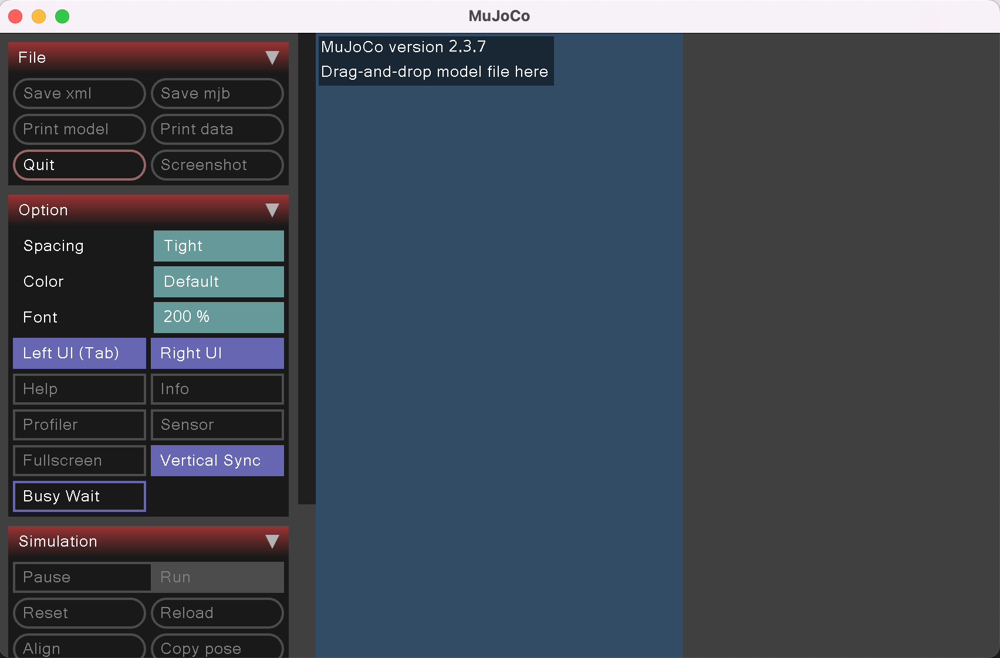
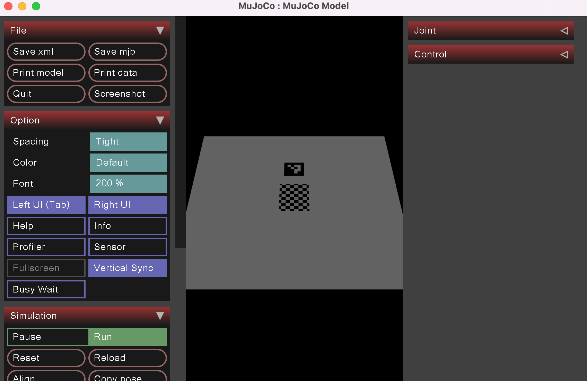

Todays lab contains of two parts. First in colab and second in MuJoCo simulator.

# Colab

https://colab.research.google.com/drive/13rRYLl8PN5FEXEpx5aZsUQW6Eohve3xK

# MuJoCo

A significant portion of robotics work occurs in simulators rather than in reality. Let's give it a try.

1. Clone this repo (it contains `world1.xml` and `4x4_1000-0.png` files)
1. Install MuJoCo (just exe, no python bindings).
   - GitHub repo is available at: https://github.com/google-deepmind/mujoco
   - Current release https://github.com/google-deepmind/mujoco/releases/tag/2.3.7
2. Run MuJoCo simulator (you should see something like this): 

3. Drag and drop the world from file `world1.xml` into the simulator (see below for further instructions) `4x4_1000-0.png` must be in the same directory as `world1.xml`

4. Familiarize yourself with moving the view, zooming, and other features.
5. Take a screenshot and use OpenCV to find an Aruco code on the screenshot.
6. Add another Aruco code to the world.
   - You will need to create your own Aruco code (https://chev.me/arucogen/)
   - Convert the SVG to PNG (ImageMagick does not work for this purpose)
   - Adjust the XML file accordingly.
7. Use OpenCV to find both Aruco codes and draw their bounding boxes.
8. Change some of the boxes to other shapes, such as cylinders or spheres.

## Description

Reference manual of MuJoCo XML can be found at:

https://mujoco.readthedocs.io/en/stable/XMLreference.html

world1.xml -  describes the world we are using. In this lab, we will only use static objects, but in general, we can also use dynamic objects that can move. Therefore, some objects may appear to be floating in the air, but this won't affect our tasks.

In an XML file we use following tags:

- `asset` - This section contains assets such as material definitions, textures, etc.
- `texture` - Represents either built-in or external textures. Note that textures may not always be 2D bitmaps, as objects can have various shapes.
- `material` -  Provides a description of materials.
- `worldbody` - Defines the entire world.
- `body` - Represents different objects; however, please note that our objects do not move in this lab.
- `geom` - Represents shapes, and in this lab, we are only using boxes.

It's important to familiarize yourself with the XML file structure, as you will need to modify it, and future lectures may involve more complex XML files.